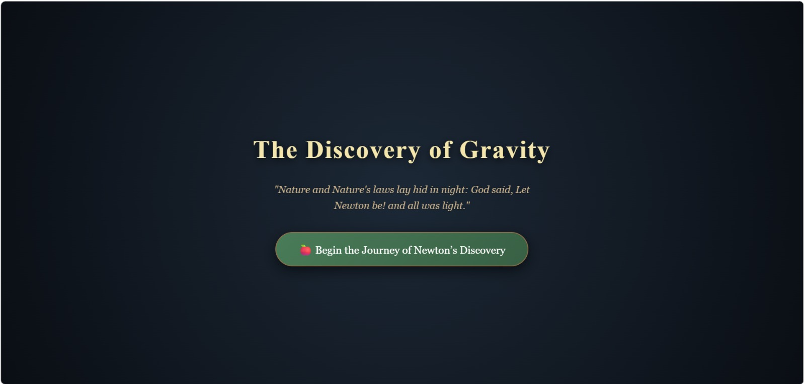
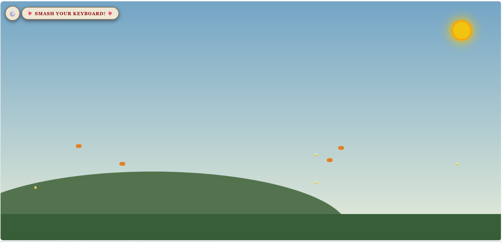
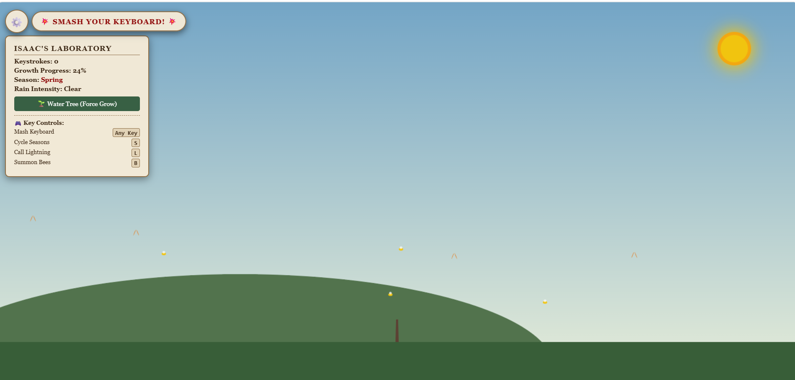
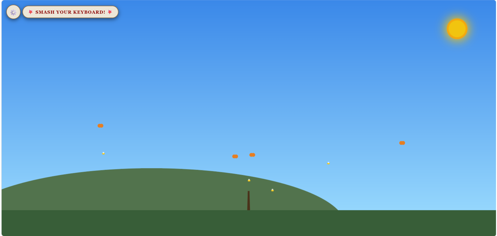
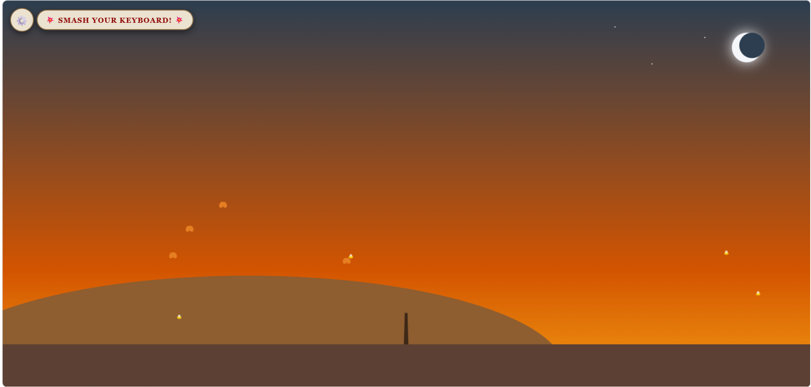
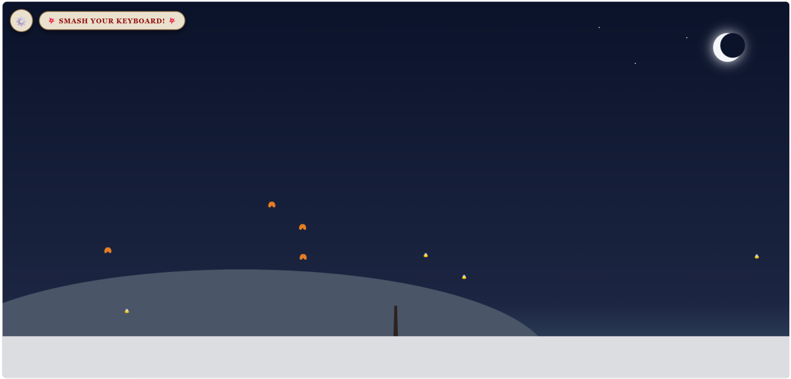
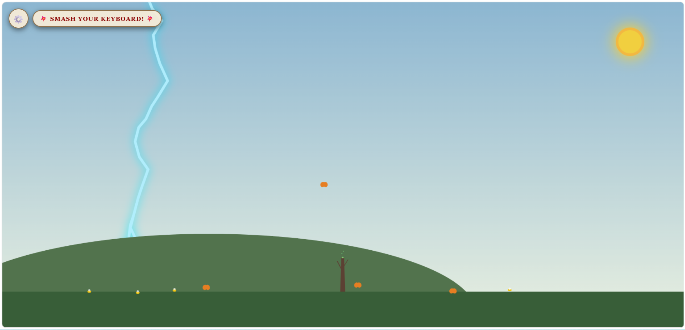
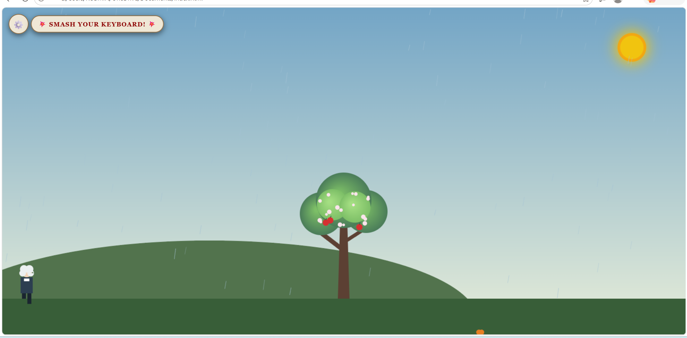
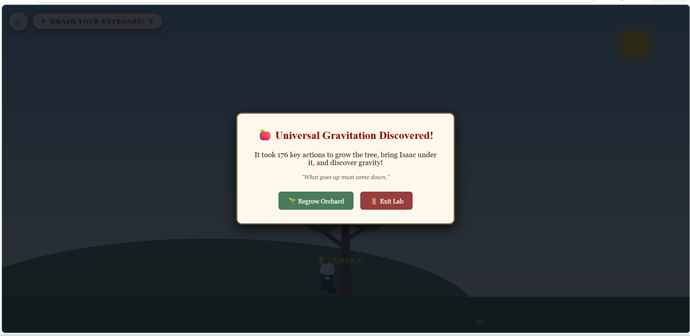
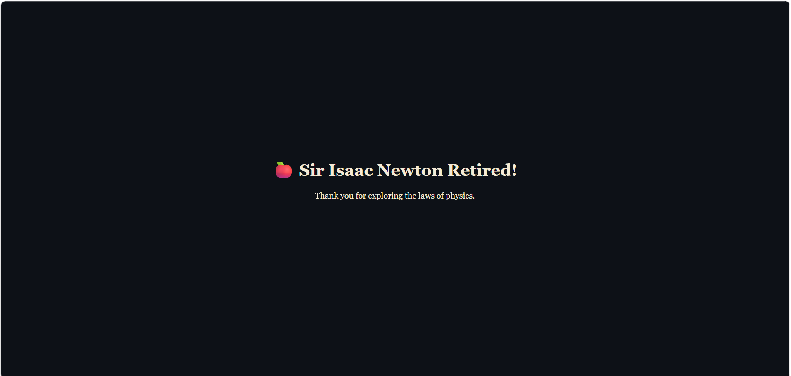

# Smash_to_Grow

## Basic Details
### Team Name: Wonderminds

### Team Members
- Member 1: Rosmin Roy - Viswajyothi College of Engineering and Technology
- Member 2: Lena Marium Thomas - Viswajyothi College of Engineering and Technology

### Project Description
A completely unnecessary gravity simulator powered by **keyboard smashing**! ⌨️💥
Smash any key to grow Newton’s apple tree, cycle through **four seasons**, summon bees, and even call down lightning. 🌳🐝⚡
Keep smashing until the tree is fully grown, Newton arrives, and the legendary apple finally falls. 🍎
Because apparently, discovering gravity requires **100% keyboard abuse and 0% actual science**. 😂

### The Problem (that doesn't exist)

Sir Isaac Newton had a serious problem: **gravity existed, but nobody had bothered to make discovering it unnecessarily complicated.**

How was Newton supposed to discover gravity while simply sitting under a tree? Where was the dramatic weather? Where were the butterflies? Where were the bees? And most importantly… **who was going to grow the apple tree by smashing random keys on a keyboard?**

Our project solves this completely imaginary crisis by forcing the user to:

* Mash the keyboard like their life depends on it.
* Grow an entire apple tree through pure button-mashing power.
* Change the seasons for absolutely no scientific reason.
* Summon bees whenever they feel like it.
* Call lightning from the sky because apparently Newton needed special effects.
* Finally wait for an apple to fall so gravity can take all the credit.

In short, we asked the most important question in science:

**“What if discovering gravity was basically a video game?”**

### The Solution (that nobody asked for)

We built an **extremely advanced scientific simulator** that solves a problem that never existed.

Instead of simply letting an apple fall like a normal person, our simulator makes you **smash your keyboard repeatedly** to grow an entire apple tree. 🌳⌨️

Once the tree is fully grown:

* 🍎 An apple appears.
* 👨‍🔬 Isaac Newton walks over.
* 🌦️ You can change the season because why not?
* ⚡ You can summon lightning for unnecessary drama.
* 🐝 You can summon bees because every serious scientific experiment needs bees.
* 🦋 Butterflies fly around to make the laboratory look fancy.
* 💡 Finally, the apple falls and **GRAVITY IS DISCOVERED!**

All of this could have been avoided by simply dropping an apple.

But where's the fun in that? 😭

**We didn't make gravity easier to understand. We made discovering it unnecessarily entertaining.**

## Technical Details
Technologies/Components Used

For Software:
Languages used: HTML5, CSS3, JavaScript (ES6+)
Frameworks used: None (Vanilla JavaScript)
Libraries used: HTML5 Canvas API, Web DOM API
Tools used: GitHub, GitHub Pages, Web Browser DevTools

### Implementation
For Software:
# Installation
[commands]

# Run
[commands]

### Project Documentation
For Software:

# Screenshots (Add at least 3)

1.get started page

2.interface

3.menu bar

4.season changing

5.season changing

6.season changing

7.lightining

8.newton coming towards the tree

9.apple fall on newton head

10.discovered gravity

11.newton retired

# Diagrams
+-----------------------------------------------------------------------------------+
|                                   USER INPUT                                      |
|            (Keyboard Press: Any Key | S (Seasons) | L (Lightning) | B (Bees))     |
+-----------------------------------------------------------------------------------+
                                          |
                                          v
+-----------------------------------------------------------------------------------+
|                                EVENT LISTENER                                     |
|  - Tracks key counts                    - Modifies state variables                |
|  - Updates rain & energy intensity      - Increments growth percentage            |
+-----------------------------------------------------------------------------------+
                                          |
                                          v
+-----------------------------------------------------------------------------------+
|                           CANVAS ANIMATION LOOP (60 FPS)                          |
|  1. Sky & Sun/Moon Render   --> Based on active season palette                    |
|  2. Dynamic Weather System  --> Renders rain droplets & lightning bolts           |
|  3. Procedural Tree Engine  --> Scales trunk, branches, foliage & apples        |
|  4. Entity System           --> Updates Newton state & wildlife vector paths      |
+-----------------------------------------------------------------------------------+
                                          |
                                          v
+-----------------------------------------------------------------------------------+
|                              DISCOVERY TRIGGER                                    |
|                   (Growth Progress reaches 100%)                                  |
|                                         |                                         |
|    +------------------------------------+------------------------------------+    |
|    |                                                                         |    |
|    v                                                                         v    |
| [Isaac Newton Walks In]                                           [Apple Falls]   |
|  Moves character from left                                         Triggers gravity|
|  to under tree canopy.                                             physics drop.  |
|    |                                                                         |    |
|    +------------------------------------+------------------------------------+    |
|                                         |                                         |
|                                         v                                         |
|                               [Collision & End Modal]                             |
|                               Apple hits head -> Modal displayed                  |
+-----------------------------------------------------------------------------------+

### Project Demo
# Video
[Add your demo video link here]
*Explain what the video demonstrates*

## Team Contributions
- Rosmin Roy:Handled repository setup, GitHub Pages deployment, and project documentation.
- Lena Marium Thomas: Developed the HTML5 Canvas graphics, keypress event controls, and animation physics.

---
Made with ❤️ at TinkerHub Useless Projects 

